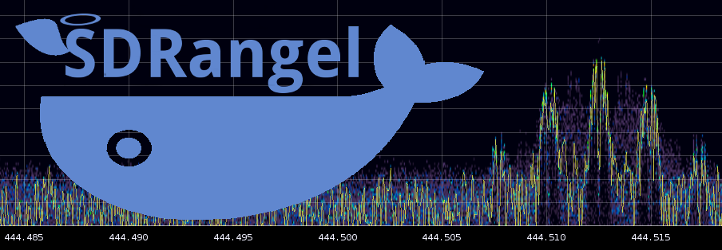

<h1>Running SDRangel in a Docker container</h1>

&#9888; This is still experimental and not guaranteed to work in all environments.

[SDRangel](https://github.com/f4exb/sdrangel) is  is an Open Source Qt5 / OpenGL 3.0+ SDR and signal analyzer frontend to various hardware. It also supports remote and terminal (no GUI) operation and can be controlled or control other pieces of software with a REST API.

[SDRangelCli](https://github.com/f4exb/sdrangelcli) is a browser based client application to control SDRangel in remote mode using its REST API.

Eventually Docker compose could be used to fire up the entire SDRangel and SDRangelCli ecosystem.

**Check the discussion group** [here](https://groups.io/g/sdrangel)

<h2>Install Docker</h2>

This is of course the first step. Please check the [Docker related page](https://docs.docker.com/install/) and follow instructions for your system.

<h3>Windows</h3>

In Windows you have two options:
  - Install with Hyper-V: Hyper-V is a bare-metal type hypervisor where the Windows O/S itself runs in a VM. The catch is that it does not work Windows 10 Home version and requires a special set up. This is required to install _Docker Desktop for Windows_. straigtforward to use.
  - Install with Oracle Virtualbox: Virtualbox is a hosted type hypervisor that sits on the top of the Windows O/S so it puts an extra layer on the stack but is available for more flavors of Windows. In this case you will install Docker in a Linux O/S Virtualbox VM for example Ubuntu 18.04 and therefore you will have to follow Linux instructions.

See [this discussion](https://www.nakivo.com/blog/hyper-v-virtualbox-one-choose-infrastructure/) about the difference between Hyper-V and Virtualbox.

After a little bit of experimentation Hyper-V and Docker Desktop for Windows is not an option for SDRangel as it has too many issues with X-Server connection, sound and USB.

<h2>Get familiar with Docker</h2>

Although a set of shell scripts are there to help you build images and run containers it is better to have some understanding on how Docker works and know its most used commands. There are tons of tutorials on the net to get familiar with Docker. Please take time to play with Docker a little bit so that you are proficient enough to know how to build and run images, start containers, etc... Be sure that this is not time wasted just to run this project. Docker is a top notch technology (although based on ancient roots) widely used in the computer industry and at the heart of many IT ecosystems.

<h2>GUI tools</h2>

Optionnally you can install a GUI tool to manage and monitor Docker images and containers.

<h3>Kitematic</h3>

Kitematic is a GUI application to monitor and configure containers live. You can check the [home page here](https://kitematic.com/). Although flagged as "legacy" in Docekr documentation it still alive on Github.

For Linux you can check the [Github repository](https://github.com/docker/kitematic) where a .deb package is available. Arch users will find a package in the AUR.

FYI in Windows/DD4W the download page is directly accessible from the menu opened by right clicking on the tray whale icon. Then follow instructions... However Windows/Hyper-V is not a viable solution as emntioned previously.

<h3>Portainer</h3>

Kitematic may not be completely functional in Linux. Then Portainer can be a good alternative or complement. Moreover Portainer has a richer functionality like showing the subnet to which a container belongs.

Portainer is a web application that is simply started as a container itself. It is started with this Docker command:

Linux: `docker run -d -p 9000:9000 -v /var/run/docker.sock:/var/run/docker.sock portainer/portainer`

Windows: `docker run -d -p 9000:9000 --name portainer --restart always -v /var/run/docker.sock:/var/run/docker.sock -v C:\ProgramData\Portainer:/data portainer/portainer`

Then you simply open a browser page at: [http://localhost:9000](http://localhost:9000). You can use a different port on the host by changing the port mapping in the Docker run command.

Portainer documentation [here](https://portainer.readthedocs.io/en/stable/deployment.html)

<h3>VS code</h3>

Visual Studio Code has a plugin from Microsoft (peterjausovec.vscode-docker) that in addition to Dockerfile syntax highlighting facilitates logging into a container and showing the logs. Click on the whale icon in the left toolbar of VS Code to access these functions.

<h2>SDRangel section</h2>

The files contained in the `sdrangel` directory are used to build and run SDRangel images. Please check the readme inside this folder for further information

<h2>SDRangelCli section</h2>

The files contained in the `sdrangelcli` directory are used to build and run SDRangelCli images. Please check the readme inside this folder for further information

<h2>WSJT-X section</h2>

Due to possible delay in the audio when running SDRangel in a container WSJT-X may fail to decode. This container compiles WSJT-X and the `libfakedate` library to tweak system time in the container. This is and all in one package for your convenience it is also possible to use `libfakedate` in the host without impacting the system clock.

<h2>Compose section</h2>

The files contained in the `compose` directory are used to set up and run Docker Compose stacks. Please check the readme inside this folder for further information
